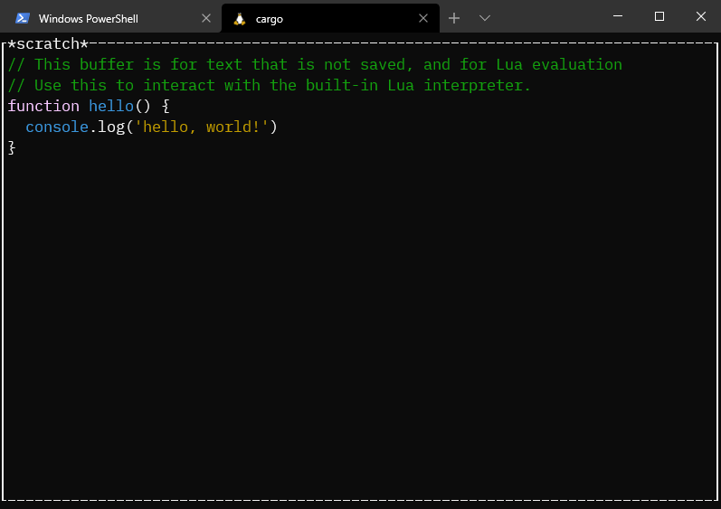

# e



a text editor designed to be extendable by lua in the same way that
emacs can.

the idea is that it should fix most of the usability and user
experience issues that emacs has.

this is first time experience with rust and tree sitter
so this is barely anything resembling a complete project lol

## build instructions
```sh
git clone https://github.com/y-ack/e.git --depth=1 --recursive
cd e
cargo run
```
